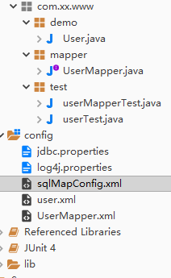

<h1><center>mybatis</center></h1>

[TOC]

## 1. JDBC原生代码

```java
public class JDBCTest{
    public static void main(String[] args){
        Connection connection = null;
        PreparedStatement stmt = null;
        ResultSet rs = null;
        try{
            // 1.加载驱动
            Class.forName("com.mysql.jdbc.Driver");
            // 2.获取连接
            connection = DrverManager.getConnection("jdbc:mysql://localhost:3306/databases-name");
            // 3.获取预处理
            stmt = connection.prepareStatement("select * from user where id = ?")；
            // 4.设置参数
            stmt.setInt(1,10);
            // 5.执行,得到结果集
            rs = stmt.executeQuery();
            // 6.从结果集中获取结果
            while(rs.next()){
                rs.getInt()
            }
        }catch(Exception e){
            System.out.print(e.printStackTrace("id") + "---" + e.printStackTrace("name"));
        }finally{
            rs.close();
            stmt.close();
            connection.close();
        }
    }
}
```

- **jdbc代码缺陷**
  1. 涉及到重复创建连接和释放连接，造成资源浪费，解决方式，使用连接池
  2. 出现硬编码，体现在，数据库驱动、url、用户名密码，sql，解决方式;使用配置文件
  3. 结果获取不方便，解决方式，把结果放到一个POJO中


## 2. mybatis架构

- 核心配置文件 sqlMapConfig.xml

```xml-dtd
<?xml version="1.0" encoding="UTF-8"?>
<!DOCTYPE configuration
PUBLIC "-//mybatis.org//DTD Config 3.0//EN"
"http://mybatis.org/dtd/mybatis-3-config.dtd">
<configuration>
</configuration>
```

- 映射文件

```xml-dtd
<?xml version="1.0" encoding="UTF-8"?>
<!DOCTYPE mapper
PUBLIC "-//mybatis.org//DTD Mapper 3.0//EN"
"http://mybatis.org/dtd/mybatis-3-mapper.dtd">
<mapper namespace="test">
</mapper>
```

## 3. mapper代理形式

- **开发规范**
  1. 接口的全路径和映射文件的namespace保持一致
  2. 接口的方法名和映射文件中的statementId保持一致
  3. 接口方法的参数类型、返回数据类型要和映射文件中的parameterType、resultType保持一致
  4. 接口和映射文件的名字最好保持一致
  5. 接口和映射文件最好放在一起

## 4. sqlMapConfig详细配置

- 加载属性文件properties标签

  ```xml
  <!--加载属性文件-->
  <properties resource="jdbc.properties"></properties>
  
  <!-- 和spring整合后 environments配置将废除 -->
  <environments default="development">
      <environment id="development">
          <!-- 使用jdbc事务管理 -->
          <transactionManager type="JDBC" />
          <!-- 数据库连接池 -->
          <dataSource type="POOLED">
              <property name="driver" value="${jdbc.driver}" />
              <property name="url" value="${jdbc.url}" />
              <property name="username" value="${jdbc.username}" />
              <property name="password" value="${jdbc.password}" />
          </dataSource>
      </environment>
  </environments>
  ```

- 配置别名**typeAliases**标签

```xml
<typeAliases>
    <!-- 
   type:类的全路径
   alias： 别名
   -->
    <!-- <typeAlias type="com.xx.www.demo.User" alias="User"/> -->

    <!-- 这种方式，默认别名就是类名 -->
    <package name="com.xx.www.demo"/>
</typeAliases>
```

- 配置映射文件

  ```xml
  <!-- 加载映射文件 -->
  <mappers>
      <mapper resource="user.xml"/>
      <mapper resource="UserMapper.xml"/>
  
      <!-- 
     使用此以下两种方式加载配置文件，需要满足以下要求：
      1. 接口和映射文件的名字保持一致
      2. 接口和映射文件放在一起
     -->
      <!-- <mapper class="com.xx.www.mapper.UserMapper"/> -->
      <!-- <package name="com.xx.www.mapper"/> -->
  </mappers>   
  ```

  ## 5. 文件结构

  



