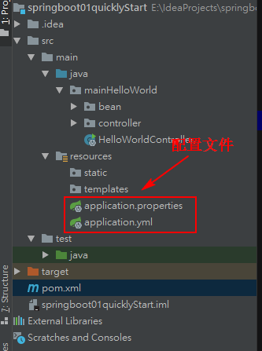

<center><h1 style="color:blue">搭建springboot工程</h1></center>

1. **运行环境**

   jdk 1.8

   maven 3.6.1

   idea 2018

2. **Maven依赖**

   ```xml
    	<parent>
           <groupId>org.springframework.boot</groupId>
           <artifactId>spring-boot-starter-parent</artifactId>
           <version>2.1.6.RELEASE</version>
       </parent>
   
       <dependencies>
           <dependency>
               <groupId>org.springframework.boot</groupId>
               <artifactId>spring-boot-starter-web</artifactId>
           </dependency>
   
           <!--配置文件提示-->
           <dependency>
               <groupId>org.springframework.boot</groupId>
               <artifactId>spring-boot-configuration-processor</artifactId>
               <optional>true</optional>
           </dependency>
   
           <!--单元测试-->
           <dependency>
               <groupId>org.springframework.boot</groupId>
               <artifactId>spring-boot-starter-test</artifactId>
               <version>2.1.6.RELEASE</version>
               <scope>test</scope>
           </dependency>
   
       </dependencies>
   
       <!--这个插件可将运用打包成一个可执行的jar包-->
       <build>
           <plugins>
               <plugin>
                   <groupId>org.springframework.boot</groupId>
                   <artifactId>spring-boot-maven-plugin</artifactId>
               </plugin>
           </plugins>
       </build>
   ```

   

3. **目录结构**

   

4. **主程序**

   ```java
   package mainHelloWorld;
   
   import org.springframework.boot.SpringApplication;
   import org.springframework.boot.autoconfigure.SpringBootApplication;
   
   @SpringBootApplication
   public class HelloWorldController {
       public static void main(String[] args) {
           SpringApplication.run(HelloWorldController.class, args);
       }
   }
   ```

   ==注==：每个工程必须有一个主程序