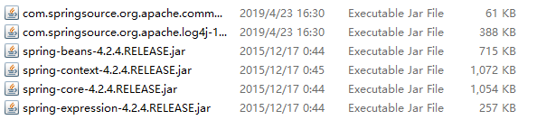
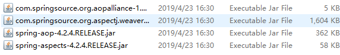
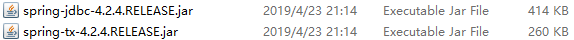
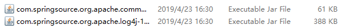

<h1>
ssh整合
</h1>

[TOC]

## 1 导入相关包

#### 1.1 struts2

##### 1.1.1 必需包

- 包的路径:**struts-2.3.37-all\struts-2.3.37\apps\struts2-blank\WEB-INF\lib\\*jar**

##### 1.1.2 需要了解的包

*以下包的路径：**struts-2.3.37-all\struts-2.3.37\lib***

- **struts2注解开发包**
  ==struts2-convention-plugin-2.3.37.jar==

- **struts2的整合AJAX的开发包**
  ==struts2-json-plugin-2.3.37.jar==

- **struts2整合Spring的开发包**

  ==struts2-spring-plugin-2.3.37.jar==

#### 1.2 hibernate5

##### 1.2.1 必需包

- 包路径：**hibernate-release-5.0.7.Final\lib\required\*.jar**

##### 1.2.2 需要了解的包

- MySQL驱动包
- 日志记录包
- 如果使用c3p0，需另外引包，路径：**hibernate-release-5.0.7.Final\lib\optional\c3p0\***

<h5>
注意：struts2和hibernate5都引入了相同的jar包（javassist包），需要删除一个
</h5>

#### 1.3 spring4

##### 1.3.1 必需包

##### 1.3.2 AOP开发

##### 1.3.3 jdbc开发

##### 1.3.4 日志

##### 1.3.5 事务管理

##### 1.3.6 整合hibernate

##### 1.3.7 整合web

## 2. 配置文件

- **struts**
  - web.xml
  - struts.xml
- **hibernate**
  - hibernate.cfg.xml
  - 映射文件
- **spring**
  - web.xml
  - applicationContext.xml
  - 日志记录