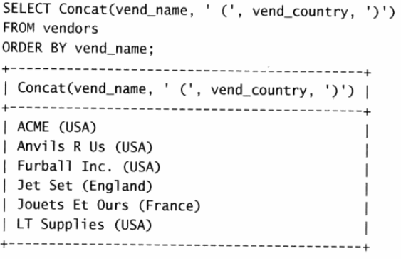

<center><h1 style="color:blue">MySQL基础</h1></center>

[TOC]

## 1. 数据库

<u>数据库</u>定义：==保存有组织的数据的容器==

<u>表</u>定义：==某种特定类型数据的结构化清单==

<u>列</u>定义:==表中的一个字段。所有表都是由一个或多个列组成的==

<u>行</u>定义：==表中的一个记录==

<u>主键</u>定义：==一列，其值能够唯一区分表中每个行==

## 2. 数据库基本指令

切换数据库：==use database_name==

显示所有的数据库：==show databases==

显示所有的表：==show tables==

显示所有的列：==show columns from database_name==

## 3.数据检索
- **select语句**
- **order by 排序**
  - 逆序 desc
  - 顺序 asc
- **where 过滤**
  - and(<u>优先级高</u>)
  - or（<u>优先级低</u>） 
  运算符：
|操作符|说明|
|---|---|
|=|等于|
|<>||
|!=||
|<=||
|>||
|>=||
|BWTWEEN...AND...|在指定的两个值之间|
- **空值检查**

  在创建表时，表设计人员可以指定其中的列是否可以不包含值。在一个列不包含值时，称其为包含空值NULL。

  > *NULL 无值，它与**字段包含0、空字符串或仅仅包含空格不同。***

​	取出为null的行，例：

       ```sql
  select * from table_name where col_name is null
       ```

- **IN 操作符**（功能和or相当）

  ```sql
  select * from table_name where col_name in (上限，下限)
  ```

  <u>优点</u>：可以包含其它select语句

- **not 操作符**

  > *not 在where子句中用来否定后跟条件的关键字。*

  <u>注意</u>：==MySQL支持使用NOT对in、between和exists子句取反。==

- **like操作符**

  - **%**  通配符：任意字符出现任意次数
  - **_**   通配符：任意字符出现一次

- **正则表达式**（**REGEXP操作符**）

  ```sql
  select * from table_name where col_name REGEXP '正则表达式'
  ```

- **创建计算字段**

  - **拼接字段**：==Concat()==

    实例：

    

  - **去除空格**：==RTrim（）、Trim（）、LTrim（）==

- **使用别名（as）**

## 4. 数据处理函数

- 文本处理函数

  |    函数     |       说明        |
  | :---------: | :---------------: |
  |   Left()    | 返回串左边的字符  |
  |  Length()   |   返回串的长度    |
  |  Locate()   | 找出串的一个子串  |
  |   Lower()   |  将串转换为小写   |
  |   LTrim()   | 去掉串左边的空格  |
  |   Right()   | 返回串右边的字符  |
  |   RTrim()   | 去掉串右边的空格  |
  |  Soundex()  | 返回串的SOUNDEX值 |
  | SubString() |  返回子串的字符   |
  |   Upper()   |  将串转换为大写   |

- 日期和时间处理函数

  | 函数          | 说明                           |
  | :------------ | :----------------------------- |
  | AddDate()     | 增加一个日期（天、周等）       |
  | AddTime()     | 增加一个时间（时、分等）       |
  | CurDate()     | 返回当前日期                   |
  | CurTime()     | 返回当前时间                   |
  | Date()        | 返回日期时间的日期部分         |
  | DateDiff()    | 计算两个日期之差               |
  | Date_Add()    | 高度灵活的日期运算函数         |
  | Date_Format() | 返回一个格式化的日期或时间串   |
  | Day()         | 返回一个日期的天数部分         |
  | DayOfWeek()   | 对于一个日期，返回对应的星期几 |
  | Hour()        | 返回一个时间的小时部分         |
  | Minute()      | 返回一个时间的分钟部分         |
  | Month()       | 返回一个日期的月份部分         |
  | Now()         | 返回当前时间和日期             |
  | Second()      | 返回一个时间的秒部分           |
  | Time()        | 返回一个日期时间的时间部分     |
  | Year()        | 返回一个日期的年份部分         |


- **数值处理函数**

  | 函数   | 说明               |
  | ------ | ------------------ |
  | Abs()  | 返回一个数的绝对值 |
  | Cos()  | 返回一个角度的余弦 |
  | Exp()  | 返回一个数的指数值 |
  | Mod()  | 返回除操作的余数   |
  | Pi()   | 返回圆周率         |
  | Rand() | 返回一个随机数     |
  | Sin()  | 返回一个角度的正弦 |
  | Sqrt() | 返回一个数的平方根 |
  | Tan()  | 返回一个角度的正切 |

- **聚集函数**

  | 函数    | 说明             |
  | ------- | ---------------- |
  | AVG()   | 返回某列的平均值 |
  | COUNT() | 返回某列的行数   |
  | MAX()   | 返回某列的最大值 |
  | MIN()   | 返回某列的最小值 |
  | SUM()   | 返回某列值之和   |

## 5. 分组数据

- **数据分组**

  > group by

  注：==group by 子句必须出现在where子句之后，order by子句之前==

- **过滤分组**

  > having

  注：==having和where区别，where过滤行，having过滤分组==

## 6. select子句顺序

| 子句     | 说明               | 是否必须使用           |
| -------- | ------------------ | ---------------------- |
| select   | 要返回的列或表达式 | 是                     |
| from     | 从中检索数据的表   | 仅在从表选择数据时使用 |
| where    | 行级过滤           | 否                     |
| group by | 分组说明           | 仅在按组计算聚集时使用 |
| having   | 组级过滤           | 否                     |
| order by | 输出排序顺序       | 否                     |
| limit    | 要检索的行数       | 否                     |

## 7. 子查询

## 8. 联接

> **外键** *外键为某个表中的一列，它包含<u>另一个表的主键值</u>定义了两个表之间的关系*