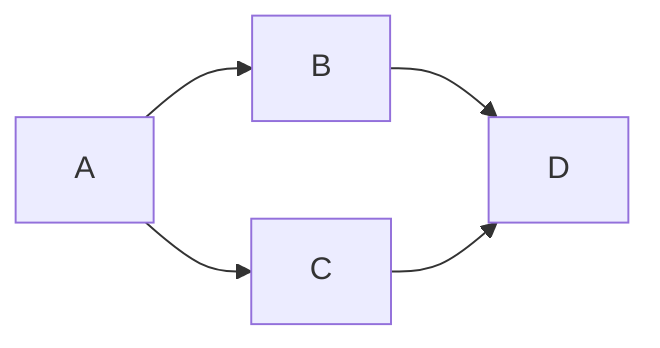
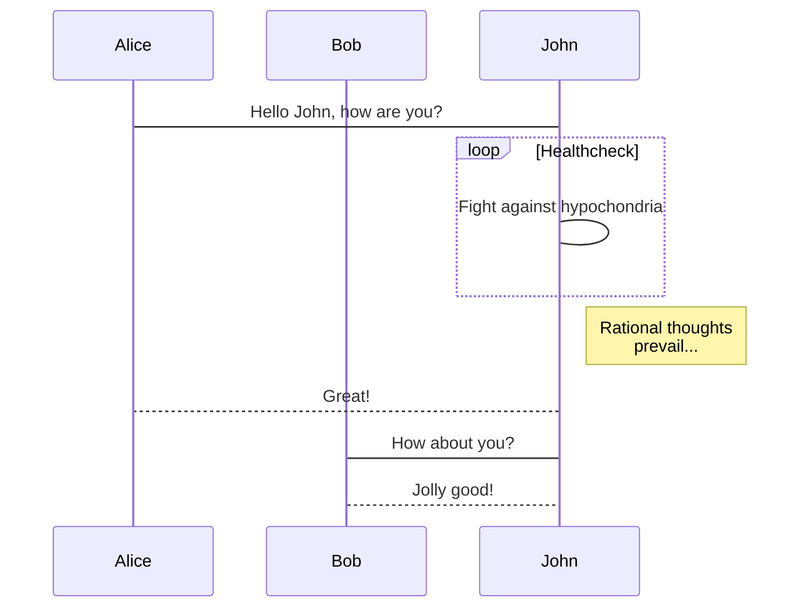
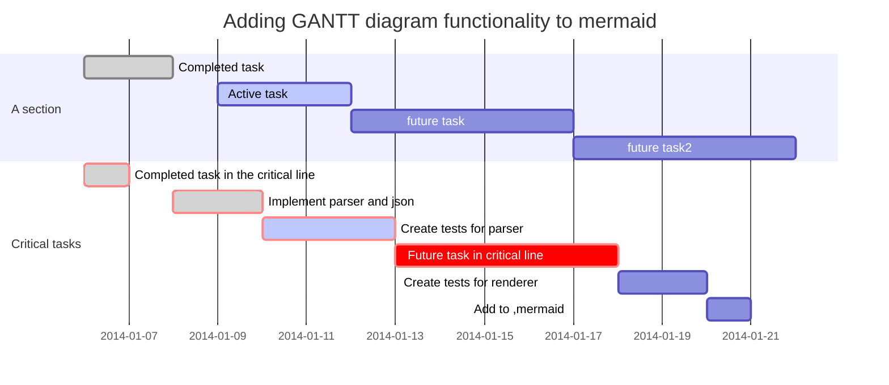
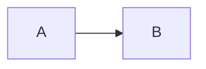
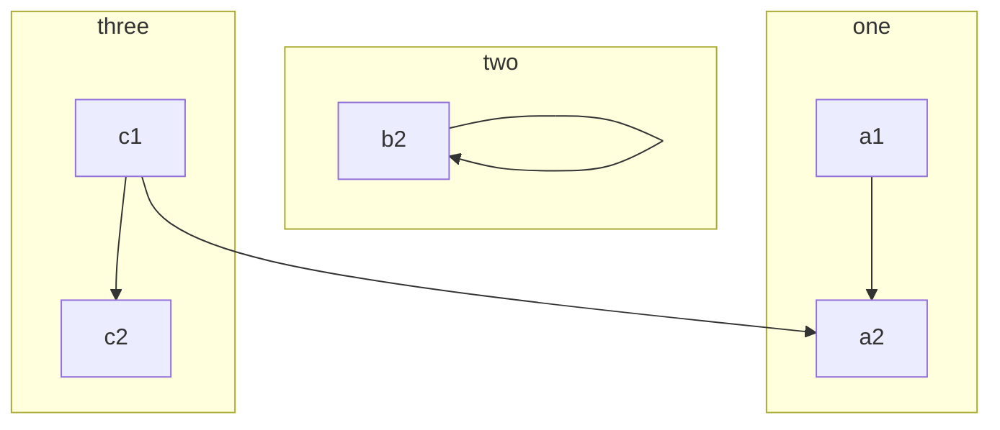

<h1>
    <center style="color:blue">mermaid 教程</center>
</h1>

[TOC]

## 1. mermaid简介

**mermaid**是一种轻便的画图工具，就像markdown一样，通过JavaScript实现图表生成


## 2. 实例

#### 2.1 流程图

```
graph LR
	A-->B;
	A-->C;
	B-->D;
	C-->D;
```



#### 2.2 时序图

```
sequenceDiagram
　　　participant Alice
　　　participant Bob
　　　Alice->John:Hello John, how are you?
　　　loop Healthcheck
　　　　　John->John:Fight against hypochondria
　　　end
　　　Note right of John:Rational thoughts <br/>prevail...
　　　John-->Alice:Great!
　　　John->Bob: How about you?
　　　Bob-->John: Jolly good!
```




#### 2.3 甘特图

```
gantt
　　　dateFormat　YYYY-MM-DD
　　　title Adding GANTT diagram functionality to mermaid
　　　section A section
　　　Completed task　　:done, des1, 2014-01-06,2014-01-08
　　　Active task 　　　　:active, des2, 2014-01-09, 3d
　　　future task 　　　　:　　　  des3, after des2, 5d
　　　future task2　　　　:　　　  des4, after des3, 5d
　　　section Critical tasks
　　　Completed task in the critical line　:crit, done, 2014-01-06,24h
　　　Implement parser and json　　　　　　:crit, done, after des1, 2d
　　　Create tests for parser　　　　　　　:crit, active, 3d
　　　Future task in critical line　　　　　:crit, 5d
　　　Create tests for renderer　　　　　　:2d
　　　Add to ,mermaid　　　　　　　　　　　:1d
```




## 3. graph

#### 3.1 方向

```
graph LR
    A --> B
```



可能方向有：

- TB：上-->下
- BT：下-->上
- RL：右-->左
- LR：左-->右
- TD：同TB


#### 3.2 节点和形状

```
graph LR
id1 默认节点
id[这是文本节点]
id(这是圆角节点)
id(这是圆节点)
id>这是非对称节点]
id{这是菱形节点}
```


#### 3.3 连接线

```
graph LR
a-->b;
a---b;
a--这是标签文本---b

```



