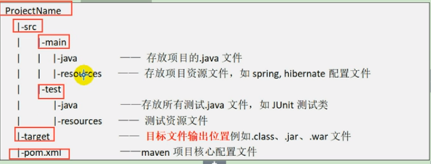

#### **阿里源**

```xml
<mirrors>

	<mirror>
        <id>aliyun-public</id>
        <mirrorOf>*</mirrorOf>
        <name>aliyun public</name>
        <url>https://maven.aliyun.com/repository/public</url>
    </mirror>

    <mirror>
        <id>aliyun-central</id>
        <mirrorOf>*</mirrorOf>
        <name>aliyun central</name>
        <url>https://maven.aliyun.com/repository/central</url>
    </mirror>

    <mirror>
        <id>aliyun-spring</id>
        <mirrorOf>*</mirrorOf>
        <name>aliyun spring</name>
        <url>https://maven.aliyun.com/repository/spring</url>
    </mirror>

    <mirror>
        <id>aliyun-spring-plugin</id>
        <mirrorOf>*</mirrorOf>
        <name>aliyun spring-plugin</name>
        <url>https://maven.aliyun.com/repository/spring-plugin</url>
    </mirror>

    <mirror>
        <id>aliyun-apache-snapshots</id>
        <mirrorOf>*</mirrorOf>
        <name>aliyun apache-snapshots</name>
        <url>https://maven.aliyun.com/repository/apache-snapshots</url>
    </mirror>

    <mirror>
        <id>aliyun-google</id>
        <mirrorOf>*</mirrorOf>
        <name>aliyun google</name>
        <url>https://maven.aliyun.com/repository/google</url>
    </mirror>

    <mirror>
        <id>aliyun-gradle-plugin</id>
        <mirrorOf>*</mirrorOf>
        <name>aliyun gradle-plugin</name>
        <url>https://maven.aliyun.com/repository/gradle-plugin</url>
    </mirror>

    <mirror>
        <id>aliyun-jcenter</id>
        <mirrorOf>*</mirrorOf>
        <name>aliyun jcenter</name>
        <url>https://maven.aliyun.com/repository/jcenter</url>
    </mirror>

    <mirror>
        <id>aliyun-releases</id>
        <mirrorOf>*</mirrorOf>
        <name>aliyun releases</name>
        <url>https://maven.aliyun.com/repository/releases</url>
    </mirror>

    <mirror>
        <id>aliyun-snapshots</id>
        <mirrorOf>*</mirrorOf>
        <name>aliyun snapshots</name>
        <url>https://maven.aliyun.com/repository/snapshots</url>
    </mirror>

    <mirror>
        <id>aliyun-grails-core</id>
        <mirrorOf>*</mirrorOf>
        <name>aliyun grails-core</name>
        <url>https://maven.aliyun.com/repository/grails-core</url>
    </mirror>

    <mirror>
        <id>aliyun-mapr-public</id>
        <mirrorOf>*</mirrorOf>
        <name>aliyun mapr-public</name>
        <url>https://maven.aliyun.com/repository/mapr-public</url>
    </mirror>

  </mirrors>

```

#### Maven项目结构



#### 命令

- **mvn compile**
  - 完成编译操作
  - 执行完毕后，会生成target目录，该目录中存放了编译后的字节文件

- **mvn clean**
  - 清除target
- **mvn test**
  - 完成单元测试操作
  - 执行完毕后，会在target目录中生成三个文件夹：surefire、surefire-reports（测试报告）、test-classes（测试字节码文件）
- **mvn package**
  - 完成打包工作
  - 执行完毕后，会在target目录生成一个文件，该文件可能是jar、war
- **mvn install**
  - 执行mvn install 命令，完成将打好的jar包安装到本地仓库的操作
  - 执行完毕后，会在本地仓库中出现安装后的jar包，方便其它工程的使用

#### 组合命令

- mvn clean comile

- mvn clean test
- mvn clean package
- mv clean install

#### 坐标的查找

访问 **http://www.mvnrepository.com**或**http://search.maven.org/**

#### 依赖

```xml
 <!-- 添加项目所需的jar包，依赖 -->
<dependencies>
    <!-- 一个依赖代表一个jar包 -->
    <dependency>
        <!-- 定义当前Maven组织名称 -->
        <groupId>junit</groupId> 
        <!-- 定义当前实际项目名称 -->
        <artifactId>junit</artifactId>
        <!-- 版本 -->
        <version>4.10</version>
        <!-- 依赖范围 -->
        <!-- 
     compile：默认编译依赖范围，对于编译，测试，运行三种casspath都有效,依赖可以被继承
     test：测试依赖范围，只对于测试classpath有效，依赖不可以被继承
     provided：已提供依赖范围，对于编译，测试的classpath都有效，但对于运行无效，因为由容器已经提供
     runtime：运行时提供
     -->
        <!--<scope>compile</scope>-->
        <!--
			optional,为true时不传递依赖，flase则传递
		-->
        <!--<optional>true</optional>-->
        <exclusions>
		<!-- 排除test3依赖 -->
			<exclusion>
	          <groupId>com.xx</groupId>
	          <artifactId>test3</artifactId>
	        </exclusion>
		</exclusions>
    </dependency>
<dependencies>
```

#### 远程仓库

Maven默认的远程仓库 **http://repo1.maven.org/maven2**

阿里云中央仓库 **http://maven.aliyun.com/nexus/content/repositories/central/**

